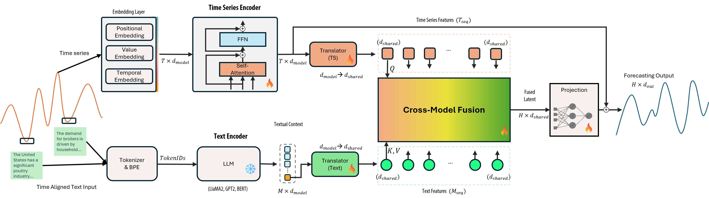
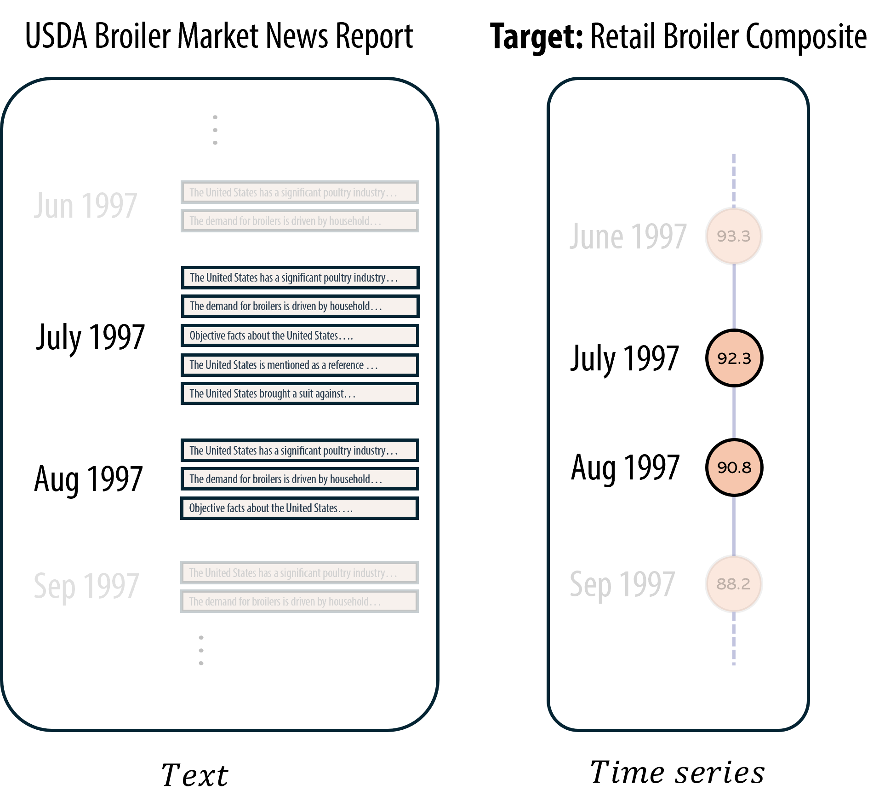

# TTCA: Text-Time Cross-Modal Attention

> **Aligning Textual Information with Time Series via Cross-Modal Attention for Time Series Forecasting**

[](LICENSE)
[]()
[]()

## Overview

**Text-Time Cross-Modal Attention (TTCA)** is a multimodal framework that enhances time-series forecasting by fusing numerical data with exogenous textual information (e.g., news headlines, reports) via a cross-attention mechanism. TTCA employs a directed cross-modal attention where time-series features serve as **queries** and textual features as **keys** and **values**, ensuring that semantic context enhances — rather than overshadows — the underlying temporal dynamics.

### Key Contributions

- **Cross-Modal Attention Mechanism**: Effectively fuses time series with auxiliary textual information by allowing temporal features to dynamically attend to relevant textual context.
- **Grouped Text Encoding**: Processes text at the temporal level with a grouped encoding mechanism that accounts for temporal alignment, avoiding information redundancy from long-text prompting.
- **State-of-the-Art Performance**: Evaluated on the [Time-MMD](https://github.com/AdityaLab/Time-MMD) dataset across 9 real-world domains, achieving average improvements of **3.29% in MSE** and **9.66% in MAE** over unimodal baselines, and competitive results against multimodal baselines (TaTS, MM-TSFlib).

## Architecture

<p align="center">
  
</p>

TTCA consists of three main components:

1. **Time Series Encoder** — Projects numerical input into a latent space via value, positional, and temporal embeddings, then applies a Transformer encoder to capture temporal dependencies. A *Translator* layer maps the output to a shared latent space for fusion.

2. **Text Encoder** — Each text snippet is grouped by temporal alignment, individually tokenized, and passed through a frozen Pre-trained Language Model (e.g., GPT-2). A pooling layer produces a unified sentence embedding per time step. A *Translator* layer projects text features into the same shared latent space.

3. **Cross-Modal Fusion (CMF)** — A Multi-Head Cross-Attention mechanism where time series features form the **Query (Q)** and text features form the **Key (K)** and **Value (V)**. A residual connection preserves the primary temporal signal while augmenting it with textual context. The fused representation is then projected to produce the final forecasting output.

## Datasets

Experiments are conducted on the **Time-MMD** dataset covering 9 domains:

| Domain | Target Variable | Dim | Frequency | Samples | Time Span |
|---|---|---|---|---|---|
| Agriculture | Retail Broiler Composite | 1 | Monthly | 496 | 1983–2025 |
| Climate | Drought Level | 5 | Monthly | 496 | 1983–2025 |
| Economy | International Trade Balance | 3 | Monthly | 423 | 1989–2025 |
| Energy | Gasoline Prices | 9 | Weekly | 1479 | 1996–2025 |
| Environment | Air Quality Index | 4 | Daily | 11102 | 1982–2023 |
| Health | Influenza Patients Proportion | 11 | Weekly | 1389 | 1997–2025 |
| Security | Disaster and Emergency Grants | 1 | Monthly | 297 | 1999–2025 |
| Social Good | Unemployment Rate | 1 | Monthly | 900 | 1950–2025 |
| Traffic | Travel Volume | 1 | Monthly | 531 | 1980–2025 |


Time-MMD Overview:
<p align="center">
  
</p>

## Results

### TTCA vs. Unimodal Baselines

TTCA is benchmarked against 5 unimodal models: **iTransformer**, **PatchTST**, **Crossformer**, **Autoformer**, and **Informer**.

| Domain | TTCA MSE | TTCA MAE | Best Baseline MSE | Best Baseline MAE | MSE Rank | MAE Rank |
|---|---|---|---|---|---|---|
| Agriculture | 0.825 | 0.617 | 0.279 | 0.351 | 4/6 | 4/6 |
| Climate | 0.901 | 0.760 | 1.021 | 0.802 | **1/6** | **1/6** |
| Economy | 0.063 | 0.208 | 0.013 | 0.090 | 3/6 | 3/6 |
| Energy | 0.342 | 0.465 | 0.244 | 0.357 | 6/6 | 6/6 |
| Environment | 0.274 | 0.399 | 0.279 | 0.389 | **1/6** | 2/6 |
| Health | 1.251 | 0.768 | 1.347 | 0.761 | **1/6** | 2/6 |
| Security | 81.886 | 4.902 | 73.079 | 4.134 | 4/6 | 4/6 |
| Social Good | 0.729 | 0.390 | 0.777 | 0.430 | **1/6** | **1/6** |
| Traffic | 0.155 | 0.252 | 0.209 | 0.268 | **1/6** | **1/6** |
| **Average** | **9.618** | **0.973** | **9.945** | **1.077** | **2.1/6** | **2.4/6** |

> TTCA achieves average improvements of **3.29% in MSE** and **9.66% in MAE**, securing an average ranking of **2.1/6** (MSE) and **2.4/6** (MAE).

### TTCA vs. Multimodal Baselines

| Domain | TTCA MSE | TTCA MAE | MM-TSFlib MSE | MM-TSFlib MAE | TaTS MSE | TaTS MAE |
|---|---|---|---|---|---|---|
| Agriculture | 0.825 | 0.617 | 0.906 | 0.736 | 0.555 | 0.495 |
| Climate | 0.901 | 0.760 | 1.206 | 0.876 | 0.927 | 0.768 |
| Economy | 0.063 | 0.208 | 0.382 | 0.497 | 0.103 | 0.244 |
| Energy | 0.342 | 0.465 | 0.732 | 0.679 | 0.492 | 0.571 |
| Environment | 0.274 | 0.399 | 0.716 | 0.665 | 0.287 | 0.399 |
| Health | 1.251 | 0.768 | 1.536 | 0.904 | 1.400 | 0.791 |
| Security | 81.886 | 4.902 | 82.080 | 4.819 | 81.386 | 4.848 |
| Social Good | 0.729 | 0.390 | 1.302 | 0.756 | 0.920 | 0.481 |
| Traffic | 0.155 | 0.252 | 0.393 | 0.490 | 0.169 | 0.231 |
| **Average** | **9.490** | **0.861** | **9.917** | **1.080** | **9.582** | **0.915** |

> TTCA outperforms MM-TSFlib with improvements of **4.31% MSE**, **20.28% MAE**, **15.86% RMSE**, **43.84% MAPE**, and **57.01% MSPE**.

## Getting Started

### Requirements

Install the dependencies:

```bash
pip install -r requirements.txt
```

### Step 1: Generate Text Embeddings (Pre-computed LLM Embeddings)

Before training TTCA, you **must** pre-compute text embeddings using a frozen Pre-trained Language Model (GPT-2):

```bash
bash scripts/generate_emb/text_embedding.sh
```

> **Why pre-compute?** TTCA decouples the LLM inference from the training loop by generating and caching text embeddings offline. Since the PLM is frozen (no weight updates), the embeddings remain constant across all training epochs — there is no need to recompute them on every forward pass. This design choice provides two key advantages:
>
> 1. **Faster training** — The multimodal fusion module trains significantly faster because it loads lightweight `.h5` embedding files instead of running a large language model at each iteration.
> 2. **Fixed, reproducible inputs** — Pre-computed embeddings guarantee that the textual representation is deterministic and consistent across runs.
>
> This differs from approaches such as [MM-TSFlib](https://github.com/AdityaLab/MM-TSFlib) and [TaTS](https://github.com/iDEA-iSAIL-Lab-UIUC/TaTS), which invoke the LLM to generate text embeddings **during** the training loop. Although their LLM weights are also frozen, running the full forward pass of a large language model at every training step introduces substantial computational overhead and slows down training considerably.

### Step 2: Train TTCA

Run the main training script:

```bash
bash scripts/fusion_cross_attention.sh
```

You can customize the training by passing a start and end dataset index:

```bash
bash scripts/fusion_cross_attention.sh 0 8
```

## Scripts

All runnable scripts are located in the `scripts/` directory. Below is a description of each script and its purpose.

### Training Scripts

| Script | Description |
|---|---|
| `scripts/fusion_cross_attention.sh` | **Main training script for TTCA** using **iTransformer** as the time series encoder backbone. Trains across all 9 Time-MMD domains with domain-specific look-back windows and prediction horizons. Supports optional start/end dataset index arguments. |
| `scripts/fusion_cross_attention_patchTST.sh` | TTCA training variant using **PatchTST** as the time series encoder backbone. Automatically computes `patch_len` based on input length (e.g., `input_len=84 → patch_len=16`, `input_len=36 → patch_len=12`). |
| `scripts/fusion_cross_attention_adding_prior.sh` | Ablation script that sweeps over multiple **fusion weights** (`prompt_weight ∈ {0.1, 0.2, 0.5, 0.8}`) to study the effect of the residual connection balance between time series and textual features. |

### Baseline Scripts

| Script | Description |
|---|---|
| `scripts/unimodal_forecasting.sh` | Trains **unimodal baselines** (Autoformer, Transformer, Informer, Crossformer, iTransformer, PatchTST) on all 9 domains using `run_unimodal.py`. No text data is used. Results are saved in `./benchmarks/logs/`. |
| `scripts/forecasting/timecma.sh` | Runs the **TimeCMA** benchmark across all 9 domains via `train.py` in the TimeCMA codebase. Results are saved in `./Results/`. |

### Embedding Generation Scripts

These scripts pre-compute text embeddings using a frozen PLM (GPT-2) before training. Embeddings are saved as `.h5` files.

| Script | Description |
|---|---|
| `scripts/generate_emb/text_embedding.sh` | Generates text embeddings for **all 9 domains** with multiple input lengths per domain. Outputs are stored in `./Embeddings/text/GPT2/<domain>/<input_len>/`. |
| `scripts/generate_emb/health.sh` | Generates text embeddings for the **Health** domain only (single input length). A lightweight script for quick single-domain embedding generation. |
| `scripts/generate_emb/timecma_embedding.sh` | Generates text embeddings in **TimeCMA-compatible format** for all 9 domains. Outputs are stored in `./Embeddings_TimeCMA/` for use with the TimeCMA benchmark. |

### Hyperparameters

| Hyperparameter | Value / Choices |
|---|---|
| Batch size | 32 |
| TS encoder hidden dim | {256, 512} |
| Fusion dimension | 256 |
| Fusion heads | 4 |
| Fusion weight | 0.5 |
| Dropout rate | {0.1, 0.5, 0.7} |
| Learning rate | {1e-4, 5e-4, 1e-3} |
| Optimizer | AdamW |
| Scheduler | Cosine annealing |
| PLM for text | GPT-2 (1.5B) |
| Training epochs | 100 |
| Early stopping patience | 20 |

### Forecasting Configurations

| Frequency | Example Domains | Look-back Window | Prediction Horizons |
|---|---|---|---|
| Daily | Environment | 96 | {48, 96, 192, 336} |
| Weekly | Energy, Health | 36 | {12, 24, 36, 48} |
| Monthly | Agriculture, Economy | 8 | {6, 8, 10, 12} |

## Citation

If you find this work useful, please cite:

```bibtex
@article{le2025ttca,
  title={Aligning Textual Information with Time Series via Cross-Modal Attention for Time Series Forecasting},
  author={Le, Hoang Anh and Dang, Thanh Vu and Yu, Gwang Hyun and Oh, Seungmin and Jo, Jung An and Kim, Jin Young},
  year={2025},
  keywords={Time Series Forecasting, Multi-Modal Fusion, Text-Time Alignment}
}
```

## License

This project is licensed under the terms of the [MIT License](LICENSE).
